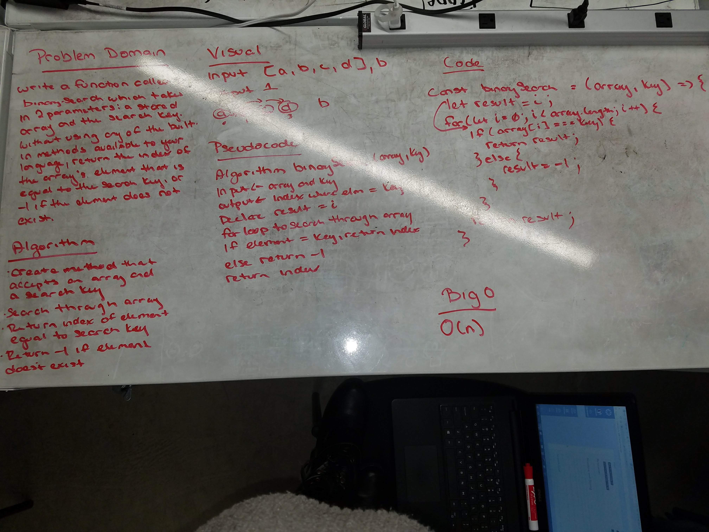

# Binary Search
Search an array for an element that matches a key and return the index without using built-in methods. Return -1 if no elements match.

## Challenge
Write a function called BinarySearch which takes in 2 parameters: a sorted array and the search key. Without utilizing any of the built-in methods available to your language, return the index of the array’s element that is equal to the search key, or -1 if the element does not exist.

## Solution
