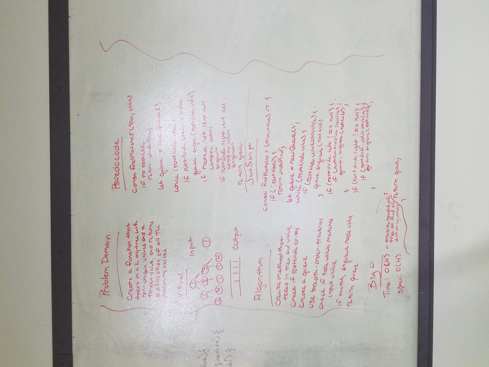

# Breadth-first
Write a function that takes in a k-ary tree and a value, finds all of the matches and returns the collections

## Challenge
Write a function that takes a k-ary tree with non-unique values and a target value.
Return a collection of all the nodes from within the tree that match the provided value.
Avoid utilizing any of the built-in methods available to your language.

## Solution
