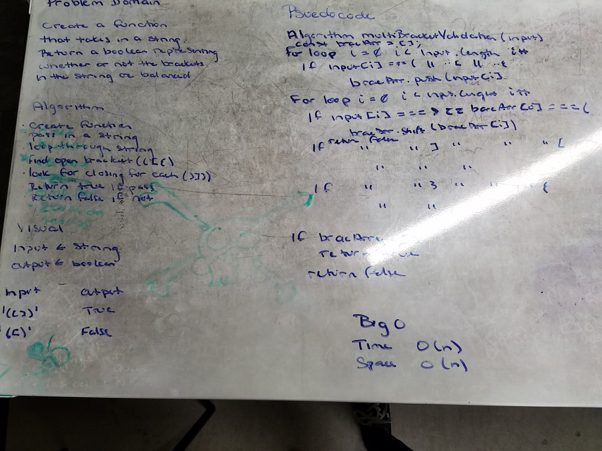

# Multi-bracket Validation
Find weather or not brackets in an inputted string are balanced.

## Challenge
Create a function called multiBracketValidation(input). Your function should take a string as its only argument, and should return a boolean representing whether or not the brackets in the string are balanced. There are 3 types of brackets:

Round Brackets : ()
Square Brackets : []
Curly Brackets : {}

## Solution
