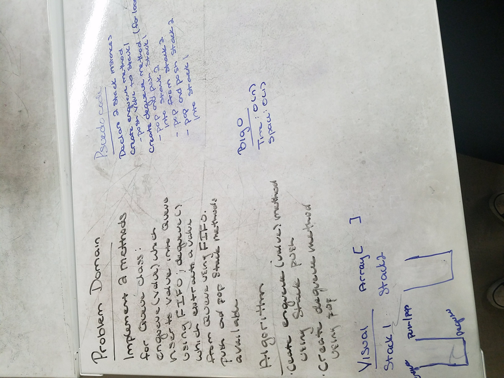

# kth from the end of a Linked List
Write two Queue methods with Stack instances with pop and push.

## Challenge
Implement the following methods for the Queue class:

enqueue(value) which inserts value into the Queue using a first-in, first-out approach.
dequeue() which extracts a value from the Queue using a first-in, first-out approach.
You have access to 2 Stack instances with push and pop methods.

## Solution
